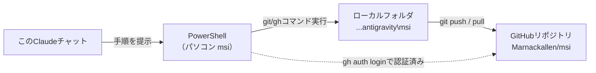

# msiリポジトリ 再接続手順書

2026-09-18

## 概要

| 項目 | 内容 |
| --- | --- |
| GitHubリポジトリ | [Marnackallen/msi](https://github.com/Marnackallen/msi)(Private) |
| ローカルフォルダ | `C:\Users\miucu\OneDrive\デスクトップ\antigravity\msi` |
| リモート名 | `origin` |
| リモートURL | `https://github.com/Marnackallen/msi.git` |
| GitHubアカウント | `Marnackallen` |
| Git user.name | `Marnackallen` |
| Git user.email | `nakauchi@miucuit.jp` |

## 全体構成図



このClaudeチャットはファイルを直接操作せず、PowerShellで実行するコマンドを提示する役割です。実際のgit/ghコマンドはローカルフォルダ内で実行され、GitHubとの通信は認証済みのPowerShellが直接行います。

## 作業再開時の動作確認手順

PCを再起動した後やしばらく間を置いて作業を再開するときは、PowerShellを開いて以下を3つ実行して接続状態を確認します。ghの認証とgitの設定はパソコン内に保存されるため、通常の再起動では消えません。

```powershell
cd "C:\Users\miucu\OneDrive\デスクトップ\antigravity\msi"
gh auth status
git remote -v
git status
```

- [ ] `gh auth status` → `Logged in to github.com account Marnackallen` と表示されればOK
- [ ] `git remote -v` → `origin  https://github.com/Marnackallen/msi.git` が fetch/push 両方に表示されればOK
- [ ] `git status` → エラーなくブランチ情報が表示されればOK

全てOKであれば、そのまま作業を続行できます。

## 認証・リモート設定が切れていた場合の再接続手順

### GitHub認証が切れていた場合(`gh auth status` がエラー)

```powershell
gh auth login
```

以下の順で選択:

1. `GitHub.com`
2. `HTTPS`
3. Git認証するか → `Yes`
4. 認証方法 → `Login with a web browser`
5. 表示されるコードを確認してEnter、ブラウザで認証を完了させる

### `origin` リモートが削除・間違っていた場合(`git remote -v` が空または違うURL)

```powershell
cd "C:\Users\miucu\OneDrive\デスクトップ\antigravity\msi"
git remote remove origin
git remote add origin https://github.com/Marnackallen/msi.git
git remote -v
```

### Gitのユーザー情報が消えていた場合

```powershell
git config --global user.name "Marnackallen"
git config --global user.email "nakauchi@miucuit.jp"
```

### `gh` や `git` がコマンドとして認識されない場合

PowerShellを一度閉じて開き直す(インストール直後はPATHが反映されていないことがあります)。それでも直らなければ、パソコンを再起動してください。

## このClaudeセッションとパソコン(msi)の再連携

パソコンを再起動すると、Claudeのデスクトップアプリとの接続が一旦切れます。通常はデスクトップアプリが起動してオンラインになれば自動で再接続されます。

自動で繋がらない場合:

1. パソコンでClaudeデスクトップアプリを起動しておく
2. このタスク(セッション)をデスクトップアプリで開き、「Link to this computer」を選択
3. その選択肢がない場合は、デスクトップアプリからこのパソコンを選択して新しいタスクを開く

フォルダ(`...\antigravity\msi`)へのアクセス許可はセッションごとに必要になる場合があります。新しいセッションでこのフォルダを使う際は、フォルダパスを伝えてもらえれば、再度アクセス許可をリクエストします。

> Windowsの仕様上、ターミナル/IDEへの画面操作(キー入力)はクリックのみに制限されるため、PowerShellでの実行は引き続き手作業での実行が必要です。
